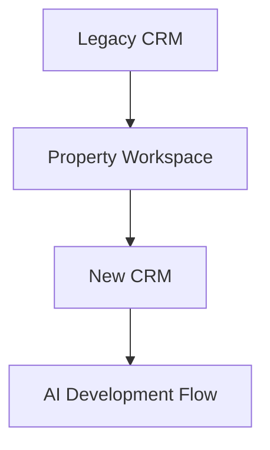
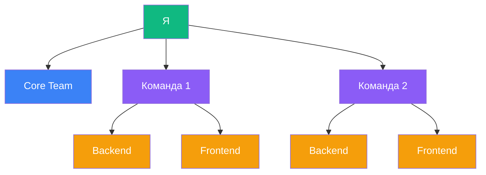
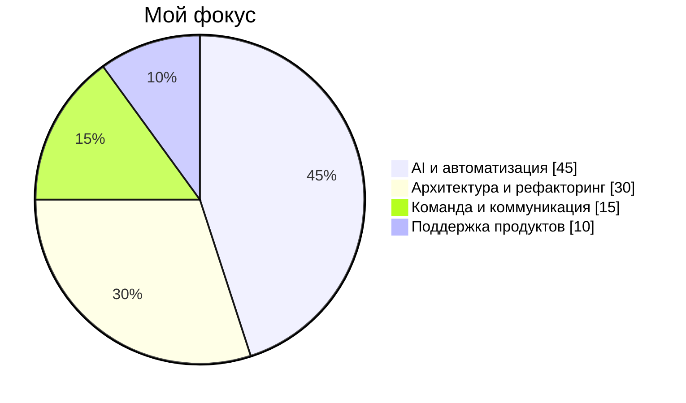
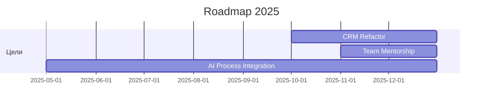

# 🚀 Performance Review 2025 — Добрин Андрей

👨‍💻 **Старший фронтенд-разработчик, BI Group**
Использую ИИ и современный подход к разработке, чтобы ускорять продукты и помогать команде расти.

---

## 💡 Коротко обо мне

За прошедший год фокус сместился с точечных задач к архитектурному и системному мышлению.
Я участвовал в интервью кандидатов, влился в процесс переписывания CRM с нуля и активно экспериментировал с ИИ-агентами, превращая их в часть своего рабочего процесса.

> Моя цель — не просто писать код, а улучшать скорость, масштабируемость и качество продукта.

---

## 🎯 Ключевые достижения

* 🚀 **Property Workspace:** выделил из монолита и создал с нуля с помощью ИИ-агентов за 10 дней.
* 🧠 **AI-разработка:** освоил оркестрацию ИИ-агентов и применяю их для ускорения задач.
* ⚙️ **Новая CRM:** участвую в архитектуре и полном переписывании легаси-системы.
* 👥 **Интервью и менторинг:** проводил собеседования, участвую в адаптации новых разработчиков.

---

## 📊 Рост и развитие

| Направление                      | Было      | Сейчас         | Рост          |
| -------------------------------- | --------- | -------------- | ------------- |
| Архитектура и системное мышление | Средний   | Сильный        | 📈 +2 уровня  |
| Использование AI-инструментов    | Низкий    | Эксперт        | ⚡️ +3 уровня  |
| Работа с командой                | Поддержка | Наставничество | 🤝 +1 уровень |
| Техническая инициатива           | Средняя   | Высокая        | 🔥 +2 уровня  |

> Акцент последних месяцев — интеграция AI в процессы, самостоятельность в принятии решений и ускорение релизов.

---

## 🧭 Принципы моей работы

* Беру инициативу, если вижу возможность улучшить продукт.
* Сам инвестирую в инструменты (Claude Pro, AI-помощники).
* Держу в голове архитектуру всей системы, а не отдельного модуля.
* Работаю не по времени, а по результату.
* Поддерживаю команду и всегда в курсе их задач.

> Структура взаимодействия между мной и командами отражает распределённую модель: я поддерживаю основную Core Team и две подкоманды (Frontend + Backend), помогая выстраивать процессы и коммуникацию.

---

## 🧩 Что для меня важно

> Технологии — это инструмент. Главное — как ты их используешь.
> Для меня важно быть полезным бизнесу, помогать команде и не стоять на месте.

---

## 🚀 Планы на 2025

* Завершить полный рефакторинг CRM и устранить накопленный техдолг.
* Активно работать с новыми членами команды, помогая им адаптироваться и вырасти.
* Продолжить развивать культуру использования ИИ в разработке.

---

> ✨ Сделано с душой, кодом и лёгкой помощью ИИ.
