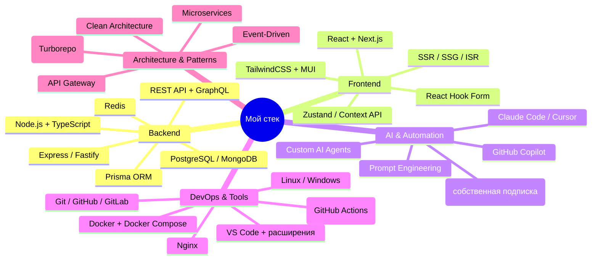
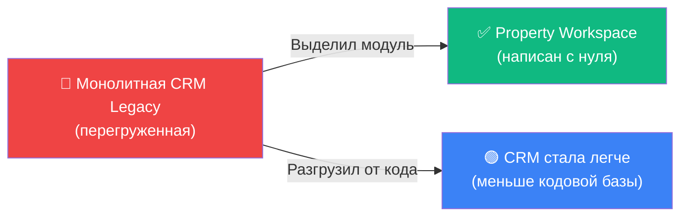
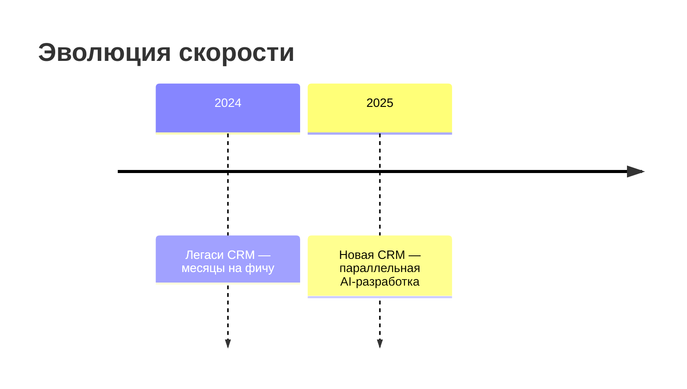
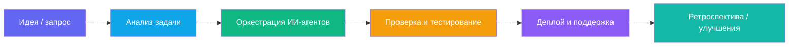
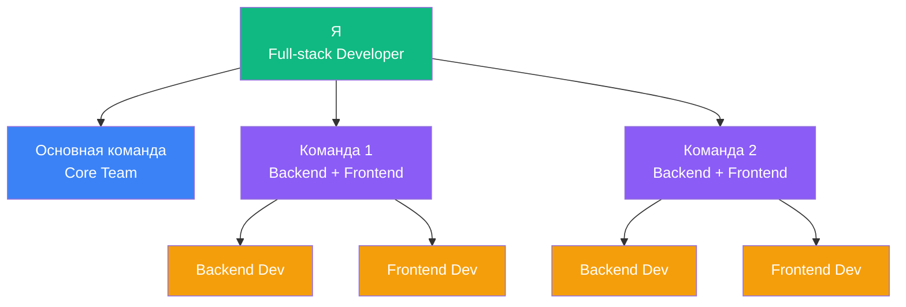
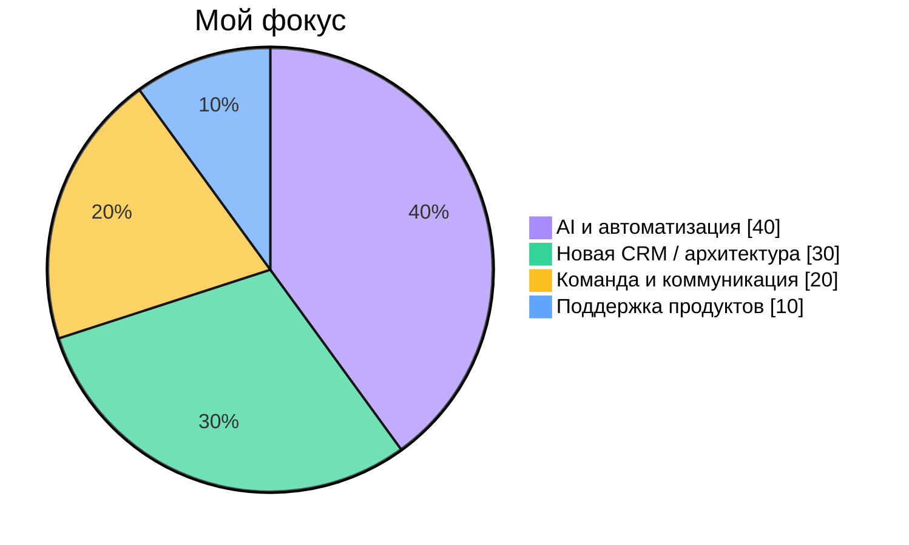
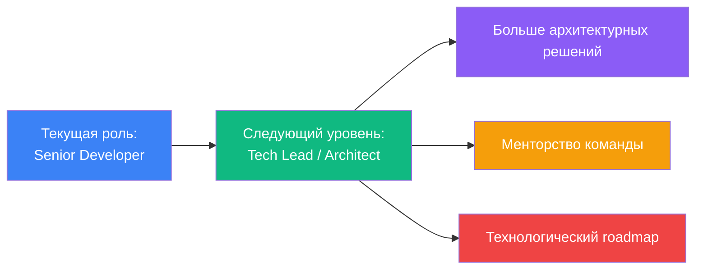

# 🚀 Привет! Я - Добрин Андрей

**Full-stack разработчик BI Group**, который использует современные технологии и ИИ, чтобы доставлять результат быстрее, качественнее и масштабируемее.

> **Цель этого документа:** показать мой вклад в развитие продуктов компании, эффект от внедрения новых подходов и готовность брать больше ответственности.

---

## 💡 О себе

Люблю, когда всё работает быстро и чисто. Я занимаюсь разработкой новой CRM с нуля, решаю ключевые бизнес-задачи и параллельно веду проекты, используя ИИ-агентов. Для меня каждая новая технология — это способ ускорить процессы и сделать продукт надёжнее.

## 🛠️ Технологический стек



**Специализация:** Full-stack с фокусом на архитектуру, оркестрацию AI-агентов и масштабируемость.

---

## 🎯 Последние достижения

- 🚀 **Property Workspace** — новое приложение за 10-15 дней вместо 3 месяцев, написано с нуля с помощью AI-агентов
- 🧱 **Разгрузка монолита** — выделил функционал из legacy CRM, сделал систему проще и легче в поддержке
- 👥 **Менторство команды** — онбординг разработчиков, code review, участие в собеседованиях
- ⚙️ **Внедрение AI-инструментов** — ускорение разработки в 6-9 раз, фокус на архитектуре вместо рутины

---

## 📌 Детальный кейс: Property Workspace

### Архитектурное решение: выделение модуля из монолита



**Ключевой момент:** Не переносил легаси-код, а написал новое приложение с нуля. **Ни единой строчки старого кода.** Монолит стал легче и проще поддерживать.

### Проблема → Решение → Результат

**Проблема:**
- Легаси CRM стала узким местом для новых фич
- Добавление модулей требовало месяцев разработки
- Высокая связность кода, риск регрессий

**Решение:**
- Спроектировал архитектуру нового модуля с нуля
- Использовал AI-агентов для параллельной разработки компонентов
- Настроил SSR с Next.js для производительности
- Интегрировал с legacy через API-шлюз

**Результат:**
```
✅ 10-15 дней вместо 90 (MVP готов к тестированию)
✅ Чистая архитектура — легко масштабировать
✅ Отзывы пользователей: "Работает быстрее старой системы"
✅ Положительная обратная связь от стейкхолдеров
✅ Команда получила шаблон для новых модулей
```

### Метрики эффекта от внедрения AI

Сравнение с разработкой аналогичных модулей в legacy CRM:

| Метрика             | До (типичный модуль) | После (с AI)       | Изменение |
| ------------------- | ------------------- | ------------------ | --------- |
| ⏱️ Сроки разработки | 90–120 дней         | **10-15 дней (MVP)**  | ↓ ~85%     |
| 🧠 Затраты времени  | 640–800 ч           | **150-180 ч**      | ↓ ~75%     |
| 🐛 Критичные баги   | 15-20 (legacy)      | **3-5 (до прода)** | ↓ ~75%     |
| 🚀 Скорость релизов | 1 релиз / 3 мес     | **2-3 релиза / мес** | ↑ ×6-9    |

> **Примечание:** Данные приблизительные и намеренно занижены. Сравнение с историческими данными по разработке аналогичных модулей в legacy системе. Реальные показатели могут быть выше, но я предпочитаю быть консервативным в оценках.



> **Вывод:** Благодаря ИИ я фокусируюсь не на рутине, а на проектировании, интеграции и архитектуре. Это позволяет создавать более качественные решения за меньшее время.

---

## 🧭 Как я работаю

- **Результат важнее часов** — фокусируюсь на задаче, а не на времени в офисе
- **Инвестирую в себя** — использую Claude Pro за свой счет, чтобы команда двигалась быстрее
- **Проактивность** — беру инициативу, когда вижу возможность улучшить продукт или процесс
- **Измеряю результат** — важно не просто сделать, а видеть реальный эффект для бизнеса
- **Командный игрок** — помогаю расти другим, делюсь знаниями и инструментами
- **Документирую решения** — чтобы команда понимала архитектуру и могла развивать систему



> Мой рабочий цикл строится вокруг итеративного улучшения: от идеи до внедрения — с акцентом на автоматизацию, проверку и результат.

---

## 🧩 Мой подход к команде

### Структура взаимодействия



**Команды:** К основной команде присоединяются 2 дополнительные команды (по 2 человека: 1 backend + 1 frontend разработчик). Я тесно взаимодействую с ними, помогая выстраивать процессы и делясь экспертизой.

> Помогаю ребятам не просто решать задачи, а понимать систему целиком.
> Объясняю архитектуру, ревьюю код, делюсь опытом и инструментами.
> Поддерживаю команду и помогаю выстраивать уверенный темп.

---

## 🧠 Что для меня важно

> Для меня важно не просто писать код, а создавать системы, которые живут долго и приносят пользу бизнесу.



---

## 🧗‍♂️ Планы и развитие

### Ближайшие цели (3-6 месяцев)

- 🔧 **Завершить рефакторинг текущей CRM** — закрыть технический долг, упростить архитектуру, сделать систему готовой к масштабированию
- 🤝 **Развитие команды** — помогать новым разработчикам быстрее адаптироваться, масштабировать использование AI-инструментов в команде
- 📚 **Создание knowledge base** — документировать архитектурные решения, best practices, чтобы команда работала автономнее

### Готов к большей ответственности



**Что я готов взять на себя:**

- Проектирование архитектуры новых модулей
- Технологические решения и выбор стека
- Менторство и рост junior/middle разработчиков
- Оценка и внедрение новых инструментов (AI, автоматизация)
- Участие в стратегических решениях по продукту

---

> — Сделано с душой ❤️ (и с лёгкой помощью ИИ)
